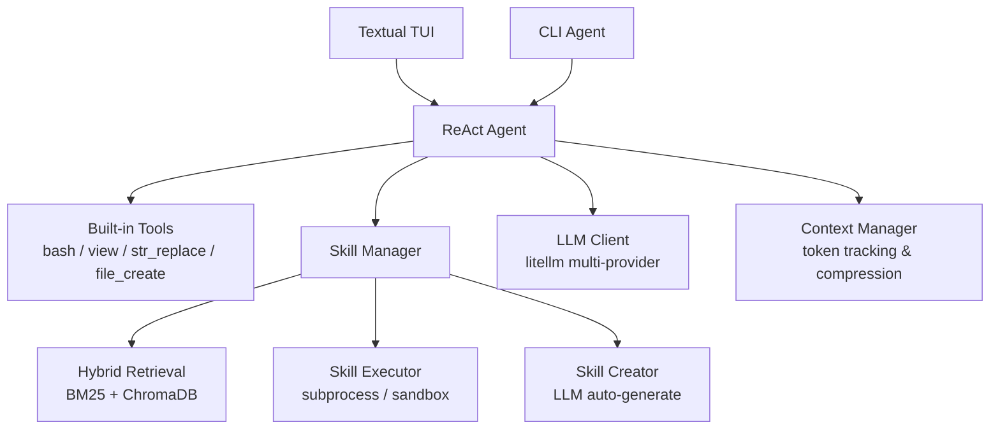

# Memento-S: Self-Evolving Skills Runner


**An intelligent agent system with self-evolving skills, multi-step workflows, and a modern TUI interface.**

---

## Quick Install

### macOS / Linux

```bash
curl -sSL https://raw.githubusercontent.com/Agent-on-the-Fly/Memento-S/main/install_mac.sh | bash
```

### Windows

```powershell
git clone https://github.com/Agent-on-the-Fly/Memento-S.git
cd Memento-S
.\install_windows.ps1
```

The installer sets up uv, Python 3.12, .venv, Node.js, openskills, and optionally downloads embedding/rerank models.

**After installation, configure your LLM provider in `.env` and run:**

```bash
cd Memento-S && .venv/bin/memento run
```

---

## Features

| Feature | Description |
|---------|-------------|
| **Self-Evolving Skills** | Automatically optimizes skills based on task failures |
| **Multi-Step Workflows** | Chains multiple skills to complete complex tasks |
| **Modern TUI** | Beautiful terminal interface powered by Textual |
| **Context Management** | Smart compression to handle long conversations |
| **GAIA Benchmark** | Built-in evaluation framework for AI capabilities |
| **Extensible Skills** | Easy to create and install custom skills |
| **Hybrid Retrieval** | BM25 + ChromaDB semantic vector search for skill routing |
| **Multi-Provider LLM** | Unified support for Anthropic, OpenAI, Ollama, OpenRouter, vLLM via litellm |

---

## Configuration

Create a `.env` file in the project root (see `.env.example` for all options).

```env
LLM_API=openai                    # Provider: anthropic/openai/openrouter/ollama/etc
LLM_MODEL=gpt-4o                  # Model name
LLM_API_KEY=your-api-key          # API key
LLM_BASE_URL=https://api.../v1    # API endpoint (optional for some providers)
LLM_MAX_TOKENS=4096               # Max response tokens
LLM_TEMPERATURE=0.7               # Sampling temperature
```

### Supported Providers

| Provider | Example |
|----------|---------|
| **Anthropic Claude** | `LLM_API=anthropic` |
| **OpenAI** | `LLM_API=openai` |
| **OpenRouter** | `LLM_API=openrouter` |
| **Local (Ollama)** | `LLM_API=ollama`, `LLM_BASE_URL=http://localhost:11434` |
| **Self-hosted (vLLM/SGLang)** | `LLM_API=openai`, custom `LLM_BASE_URL` |

---

## Usage

### TUI

```bash
.venv/bin/python tui.py run            # Launch interactive TUI
.venv/bin/python tui.py doctor         # Check system status
.venv/bin/python tui.py config         # Show configuration
.venv/bin/python tui.py chat "Hello"   # Quick single-turn chat
```

### CLI Agent

```bash
.venv/bin/python cli/main.py agent             # Interactive mode
.venv/bin/python cli/main.py agent -m "Hello"  # Single-turn mode
.venv/bin/python cli/main.py config list        # List configuration
```

### TUI Keyboard Shortcuts

| Key | Action |
|-----|--------|
| `Ctrl+C` | Quit |
| `Ctrl+B` | Toggle sidebar |
| `Ctrl+T` | Toggle log panel |
| `Ctrl+L` | Clear chat |
| `ESC` | Interrupt current task |

### In-Chat Commands

| Command | Description |
|---------|-------------|
| `/help` | Show available commands |
| `/clear` | Clear chat history |
| `/context` | Show token usage |
| `/compress` | Force compress context |
| `/skills` | List available skills |

---

## Built-in Tools & Skills

### Agent Tools

The agent has 5 built-in tools always available:

| Tool | Description |
|------|-------------|
| `bash_tool` | Run bash commands in the workspace |
| `str_replace` | Edit files with find-and-replace |
| `file_create` | Create new files with content |
| `view` | View files, directories, or images |
| `read_skill` | Read a skill's SKILL.md documentation |

### Skill Packages

| Skill | Description |
|-------|-------------|
| `web-search` | Web search (Serper) and content fetching via crawl4ai |
| `image-analysis` | Analyze images with vision models (VQA, OCR, description) |
| `pdf` | PDF reading, form filling, merging, splitting, OCR |
| `docx` | Word document creation, editing, XML manipulation |
| `xlsx` | Excel spreadsheet processing |
| `pptx` | PowerPoint creation and editing |
| `mcp-builder` | Build MCP servers |
| `skill-creator` | Create and iterate on new skills |
| `uv-pip-install` | Install Python packages via uv |

Skills can also be auto-generated by the agent at runtime via the **Delta-Skills** lifecycle (creation → audit → execution → evolution).

---

## GAIA Evaluation

```bash
python eval_gaia.py --data test_set_standalone.jsonl --start 0 --end 99
```

---

## Project Structure

```
Memento-S/
├── core/
│   ├── agent/              # ReAct agent loop & session management
│   ├── llm/                # Unified LLM client (litellm)
│   ├── config/             # Configuration (pydantic-settings)
│   ├── skills/             # Skill manager & providers
│   │   └── provider/
│   │       └── delta_skills/   # Delta-Skills lifecycle
│   │           ├── retrieval/  # BM25 + ChromaDB hybrid retrieval
│   │           ├── execution/  # Execution tracks & sandboxing
│   │           └── skills/     # Creator / auditor / store
│   └── tools/              # Built-in tools (bash, view, str_replace, etc.)
├── builtin/skills/         # Built-in skill packages
├── tui/                    # Textual TUI application
├── cli/                    # CLI entry point (Typer)
├── router_data/            # Skill catalog & embeddings
├── eval_gaia.py            # GAIA benchmark evaluation
├── tui.py                  # TUI entry point
├── install_mac.sh          # macOS installer
├── install_windows.ps1     # Windows installer
└── pyproject.toml          # Project metadata & dependencies
```

---

## Architecture



---

## Troubleshooting

| Issue | Solution |
|-------|----------|
| Skills not found | Check `SKILLS_CATALOG_PATH` in `.env` |
| API timeouts | Increase `LLM_TIMEOUT` in `.env` |
| Import errors | Ensure `.venv` is activated |
| Permission denied | Run `chmod +x install_mac.sh` |
| Browser skills fail | Run `uv run python -m playwright install chromium` |

---

## License

MIT
