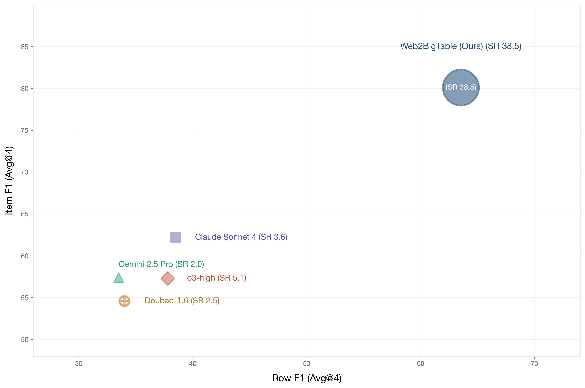
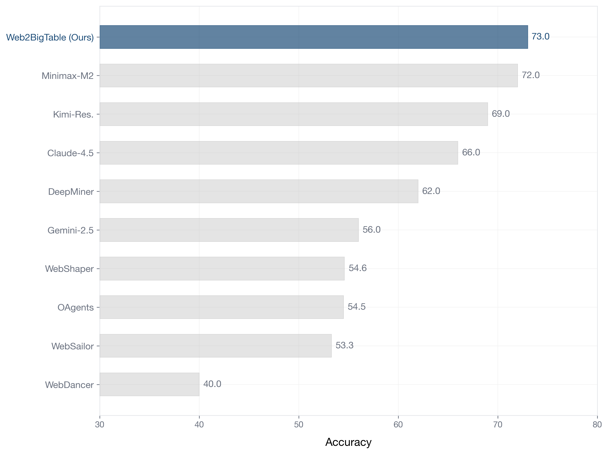
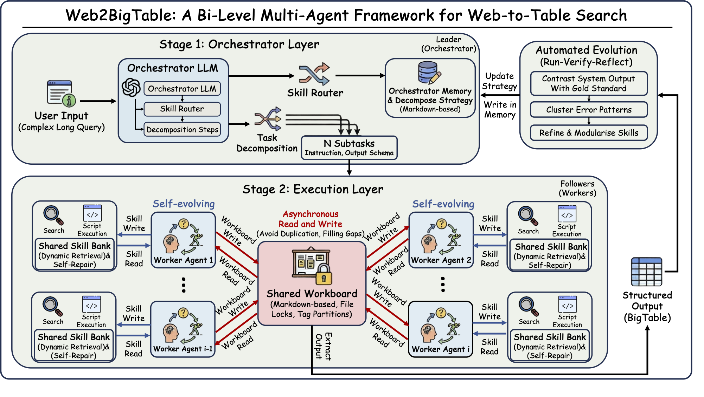

<h1 align="center">&nbsp;Memento-Team: A Bilevel Game Framework for Self-Evolving Multi-Agent Systems</h1>

<p align="center">Decompose complex tasks. Dispatch parallel workers. Evolve better strategies from every run.</p>

<p align="center">
  <a href="#what-is-memento-teams"><b>English</b></a> ·
  <a href="#chinese-summary"><b>中文摘要</b></a>
</p>

---

## What Is Memento-Teams?

Memento-Teams is a **multi-agent orchestration system** that decomposes complex tasks into parallel subtasks and executes them using skill-based worker agents. The orchestrator is built on LangChain and communicates with a pool of Memento-S workers via MCP (Model Context Protocol).

What makes it interesting is not just parallel execution. It is the **evolved decomposition strategies**. The system ships with 11 specialised decompose-* skills and a task-router, all evolved from task experience. When a new task arrives, the router selects the best decomposition pattern — so different types of tasks are broken down in different ways.

<p align="center">
  
  
  
  
  <a href="https://memento.run/"></a>
</p>

<p align="center">
  <a href="#benchmark-results">Benchmark Results</a> ·
  <a href="#one-click-install">Install</a> ·
  <a href="#quick-start-developer">Quick Start</a> ·
  <a href="#key-features">Key Features</a> ·
  <a href="#what-makes-it-different">Why It Matters</a> ·
  <a href="#memento-ecosystem">Ecosystem</a> ·
  <a href="#citation">Citation</a>
</p>

---

## Benchmark Results

We evaluate Memento-Teams on two challenging benchmarks:

- [**WideSearch**](https://widesearch.github.io/) — a benchmark for complex, multi-step information retrieval tasks requiring parallel search, data extraction, and structured output across diverse domains.
- [**XBench-DeepSearch**](https://arxiv.org/abs/2505.03829) — a benchmark for evaluating deep research capabilities on real-world questions requiring multi-hop reasoning and comprehensive web search.

<table>
<tr><td>
<p align="center">
  
</p>
<p align="center"><b>WideSearch-EN</b></p>
<p align="center"><sub>Performance landscape on WideSearch-EN (Avg@4). Position encodes Row F1 (x) and Item F1 (y); label encodes Success Rate. Dashed lines show frontier single-agent Item F1. Memento-Team dominates all three metrics simultaneously.</sub></p>
</td></tr>
</table>

<table>
<tr><td>
<p align="center">
  
</p>
<p align="center"><b>XBench-DeepSearch</b></p>
<p align="center"><sub>Accuracy on XBench-DeepSearch. Memento-Team (68.0%) surpasses all open-source agentic models and rivals frontier proprietary systems.</sub></p>
</td></tr>
</table>

---

<table>
<tr><td>
<p align="center">
  
</p>
<p align="center"><b>System Architecture</b></p>
<p align="center"><sub>The architecture of Memento-Teams. A user submits a task through the TUI. The <b>Orchestrator Agent</b> loads evolved decomposition strategies (orchestrator skills) and uses an LLM to break the task into self-contained subtasks with a shared workboard. Subtasks are dispatched in parallel to <b>Memento-S worker agents</b> via an MCP server. Each worker independently routes to the best skill, executes multi-round operations, and coordinates with other workers through the shared workboard. Results are aggregated and synthesised into a final response.</sub></p>
</td></tr>
</table>

<table>
<tr><td>
<p align="center">
  
</p>
<p align="center"><b>Game-Theoretic Framework</b></p>
<p align="center"><sub>The game-theoretic framework of Memento-Teams. The <b>Upper-Level Leader</b> (Orchestrator) reads decomposition strategies from memory and decomposes tasks into subtasks. The <b>Low-Level Follower</b> dispatches subtasks to parallel workers, each optimising its own objective while reading from and writing to a <b>Shared Memory Buffer</b> (Workboard). Both orchestrator memory and workboard are updated through a memory-write mechanism, enabling coordinated multi-agent execution.</sub></p>
</td></tr>
</table>

---

## Key Features

> **Core question.** Memento-Teams is not about building yet another chatbot wrapper.
> It is about **how to decompose hard tasks into parallel subtasks, coordinate workers effectively, and evolve better decomposition strategies from every run**.

<table>
<tr>
<td width="33%" valign="top">
<b>Decompose intelligently</b><br>
Evolved orchestrator skills route tasks to the best decomposition strategy — split by entity, time, category, rank, or dependency.
</td>
<td width="33%" valign="top">
<b>Execute in parallel</b><br>
Up to 10 Memento-S workers run concurrently, coordinating through a shared workboard to avoid redundant work and merge partial results.
</td>
<td width="33%" valign="top">
<b>Evolve from experience</b><br>
Decomposition strategies are evolved from past task executions — the system clusters task patterns and generates specialised orchestrator skills automatically.
</td>
</tr>
</table>

| Feature | Why it matters |
| --- | --- |
| **Multi-agent orchestration via MCP** | An orchestrator agent decomposes tasks and dispatches subtasks to parallel workers through a FastMCP server, enabling true concurrent execution rather than sequential tool calls. |
| **Learned decomposition strategies** | Decomposition strategies (task-router + 11 decompose-* patterns) are learned from task experience, so the system continuously improves how it breaks down different types of tasks. |
| **Shared workboard coordination** | Workers read and edit a shared markdown workboard for inter-agent communication — claim sections, post partial results, and avoid duplicate work without central locking. |
| **Semantic skill routing** | BM25 + sentence-transformer embeddings + LLM selection ensure each worker picks the best skill for its subtask, even as the skill library grows. |
| **Ops-based execution engine** | Workers use a JSON ops architecture (not function calling) with filesystem, terminal, web, workboard, and meta operations, enabling fine-grained multi-round execution within each skill. |
| **Textual TUI** | A rich terminal interface for submitting tasks, inspecting per-worker execution steps, viewing live workboard state, and reading the final synthesised output. |

## What Makes It Different?

Memento-Teams is built around a `Route → Decompose → Execute → Synthesise` loop.

| Phase | What it means |
| --- | --- |
| **Route** | The orchestrator loads evolved decomposition strategies (orchestrator skills). A task-router identifies which decomposition pattern best fits the incoming task — split by entity, time period, category, rank segment, or other evolved patterns. |
| **Decompose** | The matched decompose-* skill guides the LLM to break the task into self-contained subtasks, each with clear instructions, and creates a shared workboard for inter-worker coordination. |
| **Execute** | Subtasks are dispatched in parallel to up to 10 Memento-S workers via MCP. Each worker independently routes to the best skill, executes multi-round operations, and coordinates with other workers through the shared workboard (claim sections, post partial results, avoid duplicate work). |
| **Synthesise** | The orchestrator aggregates worker results, resolves conflicts, and produces a final structured response. |

This is the key difference from systems that simply fan out subtasks to workers. Memento-Teams uses **evolved orchestrator skills** to decide *how* to decompose each task, rather than relying on a single generic prompt.

---

## One-Click Install

```bash
curl -sSL https://raw.githubusercontent.com/Memento-Teams/Memento-Teams/main/install.sh | bash
```

<table>
<tr><td>
<p align="center">
  
</p>
<p align="center"><sub>One command to install, one command to launch. The installer sets up dependencies, downloads router assets, configures API keys, and creates the <code>memento-teams</code> command.</sub></p>
</td></tr>
</table>

The installer will:
- Install `uv` (if not present)
- Clone the repository
- Install all dependencies (Memento-S + orchestrator)
- Download router assets (skill catalog + optional embeddings)
- Configure `.env` interactively (API keys)
- Create the `memento-teams` command

## Quick Start (Developer)

```bash
git clone https://github.com/Memento-Teams/Memento-Teams.git
cd Memento-Teams

# Install Memento-S worker dependencies
cd Memento-S && uv sync --python 3.12 && cd ..

# Install orchestrator dependencies
uv sync --python 3.12
```

Create a `.env` file in the project root:

```env
OPENROUTER_API_KEY=sk-or-...
OPENROUTER_MODEL=anthropic/claude-sonnet-4-5
OPENROUTER_BASE_URL=https://openrouter.ai/api/v1
SERPER_API_KEY=...
```

Then launch:

```bash
memento-teams
```

<details>
<summary><b>Configuration</b></summary>

All configuration is centralised in environment variables. Key settings:

| Variable | Default | Description |
| --- | --- | --- |
| `OPENROUTER_API_KEY` | — | API key for LLM calls (required) |
| `OPENROUTER_MODEL` | `anthropic/claude-sonnet-4-5` | Model for Memento-S workers |
| `OPENROUTER_BASE_URL` | `https://openrouter.ai/api/v1` | LLM API base URL |
| `SERPER_API_KEY` | — | API key for web search skill (serper.dev) |
| `MAX_WORKERS` | `10` | Max parallel workers per task |
| `SEMANTIC_ROUTER_ENABLED` | `true` | Enable semantic skill pre-filtering |
| `SEMANTIC_ROUTER_TOP_K` | `4` | Number of candidate skills for LLM routing |
| `SKILL_DYNAMIC_FETCH_ENABLED` | `true` | Auto-fetch missing skills from catalog |
| `DEBUG` | `false` | Enable debug logging |
| `WORKSPACE_DIR` | `Memento-S/workspace` | Workboard location shown in TUI |

</details>

## Built-in Skills

| Skill | Description |
| --- | --- |
| `filesystem` | Read, write, edit, search, and manage files and directories |
| `terminal` | Execute shell commands with safety checks |
| `web-search` | Google search via Serper + URL fetching |
| `uv-pip-install` | Python package management via uv/pip |
| `skill-creator` | Dynamically create new skills at runtime |

Workers automatically select the best skill for each subtask via semantic routing (BM25 + embeddings + LLM). If no existing skill matches, the system can dynamically fetch or create new skills on demand.

## TUI

```bash
memento-teams
```

- Submit tasks directly from the interface (`Ctrl+Enter` or **Run Task**)
- Session-scoped worker list with per-worker status (`live` / `finished`)
- Click any worker row to inspect execution steps and events
- Live workboard view showing real-time inter-worker coordination
- Final orchestrator output panel

| Shortcut | Action |
| --- | --- |
| `Ctrl+Enter` | Run task |
| `r` | Refresh worker list |
| `c` | Copy final output to clipboard |
| `q` | Quit |

<!-- Demo video placeholder — will be added later -->

## Developer Notes

<details>
<summary><b>Project structure</b></summary>

```text
Memento-Teams/
├── tui_app.py                          # Textual TUI — primary interface
├── main.py                             # Standalone entry point (non-TUI)
├── install.sh                          # One-click installer
├── pyproject.toml                      # Root project (orchestrator deps + entry point)
├── orchestrator/
│   ├── orchestrator_agent.py           # LangChain orchestrator agent
│   └── mcp_server.py                   # FastMCP server (execute_subtasks + workboard)
├── orchestrator_skills/                # Auto-generated decomposition strategies
│   ├── task-router/                    # Routes queries to decompose strategies
│   ├── workboard/                      # Shared workboard coordination
│   ├── decompose-split-by-entity/      # Split by entity/brand
│   ├── decompose-split-by-time-period/ # Split by chronological range
│   ├── decompose-split-by-category/    # Split by categorical dimension
│   ├── decompose-split-by-rank-segment/# Split by rank ranges
│   ├── decompose-annual-rank-stats/    # Annual ranking statistics
│   ├── decompose-comparative-data-extraction/ # Comparative data extraction
│   ├── decompose-constrained-set-search/      # Constrained set search
│   ├── decompose-entity-benchmarking/  # Entity benchmarking
│   ├── decompose-geographic-registries/# Geographic registry lookup
│   ├── decompose-linear-multi-hop-dependency/ # Linear multi-hop dependency
│   ├── decompose-multimedia-source-verification/ # Multimedia source verification
│   └── decompose-temporal-event-logs/  # Temporal event log extraction
├── Memento-S/                          # Worker agent (submodule)
│   ├── core/
│   │   ├── agent/memento_s_agent.py    # Worker agent class
│   │   ├── config.py                   # Configuration & constants
│   │   ├── router.py                   # Skill routing (BM25 + embeddings + LLM)
│   │   ├── llm.py                      # LLM wrapper (OpenRouter)
│   │   ├── skill_engine/               # Planning, execution, bridge ops
│   │   └── tools/                      # Tool implementations
│   └── skills/                         # Built-in skill definitions
├── figures/                            # README figures
├── docs/                               # Documentation
└── logs/                               # Worker trajectory logs (*.jsonl)
```

</details>

<details>
<summary><b>Tech stack</b></summary>

| Layer | Technology |
| --- | --- |
| Interface | Textual (TUI) |
| Orchestration | LangChain + MCP (Model Context Protocol) |
| Worker framework | Memento-S (ops-based skill execution) |
| LLM access | OpenRouter (multi-provider) |
| Skill routing | BM25 (jieba) + sentence-transformers (BAAI/bge-m3) + LLM selection |
| MCP transport | FastMCP (stdio) |
| Coordination | Shared workboard (thread-safe markdown read/write/edit) |
| Execution | uv sandbox + subprocess isolation |
| Async runtime | asyncio |
| Build and packaging | uv + hatchling |

</details>

## FAQ

| Problem | Solution |
| --- | --- |
| Skills not found | Check that `Memento-S/skills/` exists and skill catalog is downloaded. |
| API timeout | Increase the model timeout or switch to a faster model in `.env`. |
| Import errors | Make sure both virtual environments are active: `Memento-S` and root. |
| Web search fails | Check whether `SERPER_API_KEY` is configured in `.env`. |
| Workers stuck | Check `logs/worker-*.jsonl` for error details. Increase `MAX_WORKERS` if tasks queue. |
| Workboard conflicts | Workers use tagged sections — check `.workboard.md` for malformed edits. |

## Memento Ecosystem

Memento-Teams is part of the broader **Memento** project family.

| Resource | Link | Description |
| --- | --- | --- |
| **Memento Homepage** | [memento.run](https://memento.run/) | The hub for all Memento series projects and research |
| **Memento-Skills** | [GitHub](https://github.com/Memento-Teams/Memento-Skills) | Single-agent self-evolving skill framework |
| **Memento-Teams** | [GitHub](https://github.com/Memento-Teams/Memento-Teams) | Multi-agent orchestration with self-improving decomposition (this repo) |
| **Discord Community** | [Join Discord](https://discord.com/invite/ztFS5YmB) | Discussion, Q&A, feature requests, and collaboration |

## Citation

If you find Memento-Teams useful in your research, please cite:

```bibtex
@article{memento-teams2026,
  title={Memento-Teams: Multi-Agent Orchestration with Self-Improving Decomposition},
  author={},
  journal={arXiv preprint},
  year={2026}
}
```

> Paper coming soon. Citation will be updated with full author list and arXiv ID upon publication.

## Chinese Summary

<details>
<summary><b>点击展开中文摘要</b></summary>

Memento-Teams 是一个多智能体协作系统，核心思路是将复杂任务分解为可并行执行的子任务，由多个 Memento-S 工作智能体同时处理，并通过共享工作板（workboard）进行协调。

系统围绕 `路由 → 分解 → 执行 → 合成` 的在线流程构建。编排智能体（Orchestrator）通过 task-router 识别任务类型，匹配最佳的 decompose-* 分解策略，将任务拆分为独立子任务；工作智能体通过语义路由选择最佳技能并行执行，通过共享 workboard 进行协调；最后编排智能体聚合结果，生成最终响应。

在 WideSearch-EN 基准测试中，Memento-Teams 在 Row F1（63.5）、Item F1（80.1）和 Success Rate（38.5）三项指标上全面超越 o3-high、Gemini 2.5 Pro、Claude Sonnet 4 等前沿基线。在 XBench-DeepSearch 上达到 68.0% 准确率，超越所有开源智能体模型，接近前沿商业系统。

</details>

## Licence

MIT
